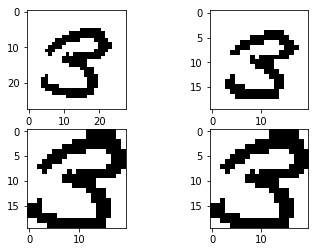
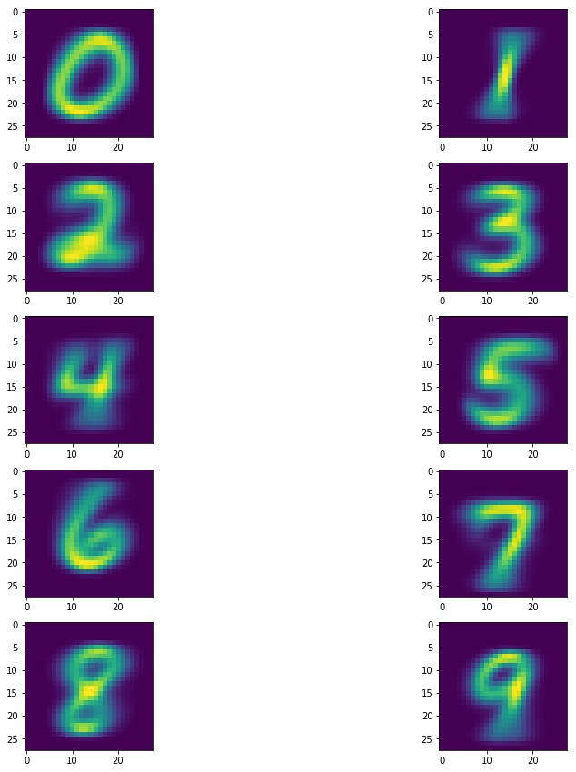

```python

%matplotlib inline
from matplotlib import pyplot as plt
import tensorflow as tf
from scipy.stats import norm
import numpy as np
import cv2
from math import log
mnist = tf.keras.datasets.mnist
(x_train, y_train),(x_test, y_test) = mnist.load_data()
ret, x_train_thresh = cv2.threshold(x_train, 127, 1, cv2.THRESH_BINARY)
ret, x_test_thresh = cv2.threshold(x_test, 127, 1, cv2.THRESH_BINARY)

def getStretchedImage(img):
    rows = np.any(img, axis=1)
    cols = np.any(img, axis=0)
    rmin, rmax = np.where(rows)[0][[0, -1]]
    cmin, cmax = np.where(cols)[0][[0, -1]]
    cropped = img[rmin:rmax, cmin:cmax]
    return cv2.resize(cropped, (20,20), interpolation=cv2.INTER_NEAREST)

def plotSampleFig(x_train_thresh, x_train_thresh_stretch):
    pixels = x_train_thresh[11232]
    img2 = cv2.resize(pixels, (20, 20), interpolation = cv2.INTER_NEAREST)
    img3 = getStretchedImage(pixels)
    f, axarr = plt.subplots(2,2)
    axarr[0,0].imshow(pixels, cmap=plt.cm.binary)
    axarr[0,1].imshow(img2, cmap=plt.cm.binary)
    axarr[1,0].imshow(img3, cmap=plt.cm.binary)
    axarr[1,1].imshow(x_train_thresh_stretch[11232], cmap=plt.cm.binary)
    plt.show()


x_train_thresh_stretch = np.array([getStretchedImage(x_train_thresh[i]) for i in range(len(x_train_thresh))])
x_test_thresh_stretch = np.array([getStretchedImage(x_test_thresh[i]) for i in range(len(x_test_thresh))])
plotSampleFig(x_train_thresh, x_train_thresh_stretch)

print("Shape of stretched training set " + repr(x_train_thresh_stretch.shape[0]))
x_train_flat_thresh = x_train_thresh.reshape(60000, 784)
x_test_flat_thresh = x_test_thresh.reshape(10000, 784)
x_train_flat_thresh_stretch = x_train_thresh_stretch.reshape(60000, 400)
x_test_flat_thresh_stretch = x_test_thresh_stretch.reshape(10000, 400)

def calculateAccuracy(nb, x_test, y_test, dataType="Untouched", setType="Test", modelType="Gaussian"):
    y_pred = np.apply_along_axis(nb.predict, 1, x_test)
    correct = np.sum(y_pred == y_test)
    accuracy = (correct/float(len(y_test)) * 100.0)
    print("Set-type: %s, DataType: %s, ModelType: %s, Accuracy: %f"%(setType, dataType, modelType, accuracy))
```





    Shape of stretched training set 60000


```python
class NaiveBayesGaussian:
    
    def fit(self, X, Y):
        self.normDF = {}
        self.priors = {}
        categories = set(Y)
        for c in categories:
            XForC = X[Y == c]
            self.normDF[c] = {
                'mean' : np.nanmean(XForC, axis=0),
                'var': np.nanvar(XForC, axis=0)
            }
            self.priors[c] = 1.0 * len(Y[Y == c])/ len(Y)    

    def predict(self, X, smoothing=.01):
        P = {}
        for c, g in self.normDF.items():
            mean, var = g['mean'], g['var']
            var = var + smoothing
            normPdf = norm.pdf(X, mean, np.sqrt(var))
            normPdf[normPdf == 0] = np.nan
            classConditionalProb = np.nansum(np.log(normPdf))
            P[c] = classConditionalProb + np.log(self.priors[c])  
            bestCategory, bestProb = None, float("-inf")
        for category, probability in P.items():
            if bestCategory is None or probability > bestProb:
                bestProb = probability
                bestCategory = category
        return bestCategory
 

nb = NaiveBayesGaussian()
nb.fit(x_train_flat_thresh, y_train)
print("Done training NB Gaussian untouched")
calculateAccuracy(nb, x_test_flat_thresh, y_test, "Untouched", "Test", "Gaussian")
calculateAccuracy(nb, x_train_flat_thresh, y_train, "Untouched", "Train", "Gaussian")


f, axarr = plt.subplots(5,2 , figsize=(15,15))
k = 0
mean_img_arr = [g['mean'] for c, g in nb.normDF.items()]
for i in range(5):
    for j in range(2):
        axarr[i, j].imshow(mean_img_arr[k].reshape((28,28)))
        k+= 1
plt.show()

nb = NaiveBayesGaussian()
nb.fit(x_train_flat_thresh_stretch, y_train)
print("Done training NB Gaussian stretched")
calculateAccuracy(nb, x_test_flat_thresh_stretch, y_test, "Stretched", "Test", "Gaussian")
calculateAccuracy(nb, x_train_flat_thresh_stretch, y_train, "Stretched", "Train", "Gaussian")
```

    Done training NB Gaussian untouched
    Set-type: Test, DataType: Untouched, ModelType: Gaussian, Accuracy: 79.860000
    Set-type: Train, DataType: Untouched, ModelType: Gaussian, Accuracy: 79.041667





    Done training NB Gaussian stretched
    Set-type: Test, DataType: Stretched, ModelType: Gaussian, Accuracy: 82.450000
    Set-type: Train, DataType: Stretched, ModelType: Gaussian, Accuracy: 81.656667


```python

class BernoulliNBClassifier(object):

    def __init__(self):
        self.priors = {}
        self.cond_probs = {}

    def fit(self, X, Y):
        digits = set(Y)
        for d in digits:
            XForD = X[Y == d]
            N = len(Y[Y == d])
            self.priors[d] = log(1.0 * N/ len(Y)) 

            """Compute log( P(X|Y) )
               Use Laplace smoothing
               n1 + 1 / (n1 + n2 + 2)
            """
            countOf1 = np.count_nonzero(XForD, axis=0)
            countOf1 = (countOf1 + 1.) /(N + 2.)
            self.cond_probs[d] = countOf1


    def predict(self, X):
        """Make a prediction from text
        """

        pred_class = None
        max_ = float("-inf")

        # Perform MAP estimation
        for d in self.priors:
            log_sum = self.priors[d]
            log_sum += np.sum(np.log(self.cond_probs[d][X == 1]))
            log_sum += np.sum(np.log(1 - self.cond_probs[d][X == 0]))
            if log_sum > max_:
                max_ = log_sum
                pred_class = d

        return pred_class

nb = BernoulliNBClassifier()
nb.fit(x_train_flat_thresh, y_train)
print("Done training NB Bernoulli untouched")
calculateAccuracy(nb, x_test_flat_thresh, y_test, "Untouched", "Test", "Bernoulli")
calculateAccuracy(nb, x_train_flat_thresh, y_train, "Untouched", "Train", "Bernoulli")


nb = BernoulliNBClassifier()
nb.fit(x_train_flat_thresh_stretch, y_train)
print("Done training NB Bernoulli stretched")
calculateAccuracy(nb, x_test_flat_thresh_stretch, y_test, "Stretched", "Test", "Bernoulli")
calculateAccuracy(nb, x_train_flat_thresh_stretch, y_train, "Stretched", "Train", "Bernoulli")

```

    Done training NB Bernoulli untouched
    Set-type: Test, DataType: Untouched, ModelType: Bernoulli, Accuracy: 84.270000
    Set-type: Train, DataType: Untouched, ModelType: Bernoulli, Accuracy: 83.576667
    Done training NB Bernoulli stretched
    Set-type: Test, DataType: Stretched, ModelType: Bernoulli, Accuracy: 83.690000
    Set-type: Train, DataType: Stretched, ModelType: Bernoulli, Accuracy: 82.521667


```python
from sklearn.ensemble import RandomForestClassifier

def runDecisionForestClassifier(x_train, y_train, x_test, y_test, numOfTrees, maxDepth, dataType="Untouched"):
    clf = RandomForestClassifier(n_estimators=numOfTrees, max_depth=maxDepth)
    clf.fit(x_train, y_train)
    y_pred_test = clf.predict(x_test)
    y_pred_train = clf.predict(x_train)
    
    correct_test = np.sum(y_pred_test == y_test)
    correct_train = np.sum(y_pred_train == y_train)
    accuracy_test = (correct_test/float(len(y_test)) * 100.0)
    accuracy_train = (correct_train/float(len(y_train)) * 100.0)
    print("%s image, %d trees, %d depth, test-set-accuracy: %f, train-set-accuracy: %f" %(dataType, numOfTrees, maxDepth, accuracy_test, accuracy_train ))


runDecisionForestClassifier(x_train_flat_thresh, y_train, x_test_flat_thresh, y_test, 10, 4)
runDecisionForestClassifier(x_train_flat_thresh, y_train, x_test_flat_thresh, y_test, 30, 4)
runDecisionForestClassifier(x_train_flat_thresh, y_train, x_test_flat_thresh, y_test, 10, 16)
runDecisionForestClassifier(x_train_flat_thresh, y_train, x_test_flat_thresh, y_test, 30, 16)
strch = "Stretched"
runDecisionForestClassifier(x_train_flat_thresh_stretch, y_train, x_test_flat_thresh_stretch, y_test, 10, 4, strch)
runDecisionForestClassifier(x_train_flat_thresh_stretch, y_train, x_test_flat_thresh_stretch, y_test, 30, 4, strch)
runDecisionForestClassifier(x_train_flat_thresh_stretch, y_train, x_test_flat_thresh_stretch, y_test, 10, 16, strch)
runDecisionForestClassifier(x_train_flat_thresh_stretch, y_train, x_test_flat_thresh_stretch, y_test, 30, 16, strch)

```

    Untouched image, 10 trees, 4 depth, test-set-accuracy: 70.580000, train-set-accuracy: 69.641667
    Untouched image, 30 trees, 4 depth, test-set-accuracy: 75.400000, train-set-accuracy: 74.858333
    Untouched image, 10 trees, 16 depth, test-set-accuracy: 93.560000, train-set-accuracy: 98.941667
    Untouched image, 30 trees, 16 depth, test-set-accuracy: 95.400000, train-set-accuracy: 99.476667
    Stretched image, 10 trees, 4 depth, test-set-accuracy: 73.170000, train-set-accuracy: 71.623333
    Stretched image, 30 trees, 4 depth, test-set-accuracy: 76.010000, train-set-accuracy: 74.656667
    Stretched image, 10 trees, 16 depth, test-set-accuracy: 94.360000, train-set-accuracy: 99.455000
    Stretched image, 30 trees, 16 depth, test-set-accuracy: 96.140000, train-set-accuracy: 99.730000

